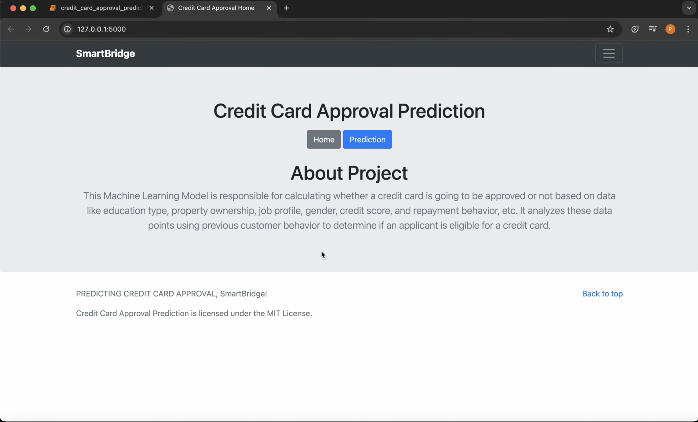
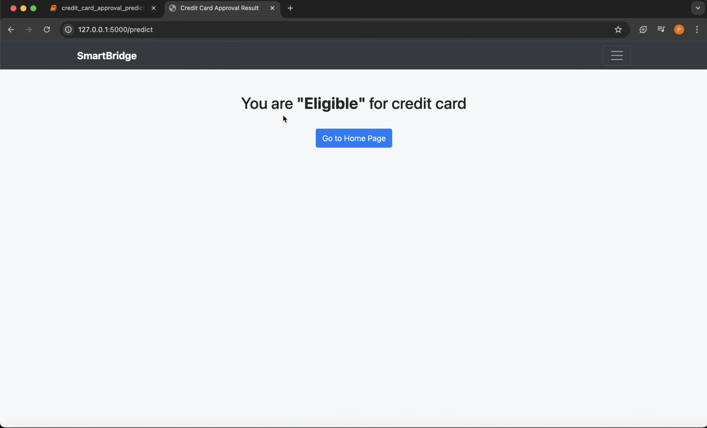

# Credit Card Approval Prediction 💳🤖


---

## 📑 Table of Contents
- [Overview](#-overview)
- [Features](#-features)
- [Tech Stack](#-tech-stack)
- [Project Structure](#-project-structure)
- [Installation & Usage](#️-installation--usage)
- [Results & Achievements](#-results--achievements)
- [Contributing](#-contributing)
- [Acknowledgments](#-acknowledgments)
- [Contact](#-contact)
- [License](#-license)

---

## 📌 Overview

This project was developed as part of my **CDC Internship with SmartBridge in collaboration with Google for Developers**.  
It focuses on building a **Machine Learning model** to predict **credit card approval** based on applicant data.  
The solution is deployed using **Flask**, providing an easy-to-use web interface for predictions.  

🎥 **[Watch the Demo on YouTube](https://youtu.be/Ffedumx9d_8)**

It includes both:
- A **Jupyter Notebook** for exploratory analysis and model building  
- A **Flask Web Application** for user interaction  

---

## 🎯 Objectives

- Perform **data preprocessing and cleaning** on credit card applicant data  
- Apply **EDA** to uncover trends and patterns  
- Train and evaluate multiple ML models with **Scikit-Learn**  
- Deploy the best-performing model using **Flask**  

---
## 🚀 Features
- 📊 **Data Preprocessing:** Handling missing values & cleaning raw inputs  
- 🔍 **Exploratory Data Analysis (EDA):** Gaining insights from applicant data  
- 🤖 **Model Development:** Training ML models with Scikit-learn  
- ⚡ **Hyperparameter Tuning:** Optimizing performance metrics  
- 🌐 **Flask Web App:** User-friendly interface for predictions  
- 📑 **End-to-End Pipeline:** From data preprocessing to prediction  

---

## 🛠️ Tech Stack
- **Programming Language:** Python 3.9+  
- **Libraries:** Pandas, NumPy, Scikit-learn, Matplotlib, Seaborn  
- **Framework:** Flask  
- **Tools:** Jupyter Notebook  

---

## 📂 Project Structure
```plaintext
creditcardapproval/
│
├── dataset/
│   ├── application_record.csv
│   └── credit_record.csv
│
├── Flask/
│   ├── app.py
│   ├── model.pkl
│   └── templates/
│       ├── index.html
│       ├── result.html
│       └── res1.html
│
├── credit_card_approval_prediction.ipynb
├── model.pkl
├── requirements.txt
├── README.md
└── .gitignore
```
---

## ⚙️ Installation & Usage

### 🔧 Step 1: Clone the repository
```bash
git clone https://github.com//creditcardapproval.git
cd creditcardapproval
```

### 🔧 Step 2: Create & activate a virtual environment
```bash
python -m venv venv
# On Windows
venv\Scripts\activate
# On Linux/Mac
source venv/bin/activate
```
### 🔧 Step 3: Install dependencies
```bash
pip install -r requirements.txt
```
### 🔧 Step 4: Run the Flask application
```bash
cd Flask
python app.py
```
- 📌 Once the application is running, open your web browser and navigate to the following address:
- 👉 http://127.0.0.1:5000/

<!-- ## 📷 Screenshots
Here’s a preview of the application in action:


 -->
---
## 📊 Results & Achievements
- ✅ Achieved an **87.4/100** performance score during the final internship evaluation.

- ✅ Delivered **strong predictive accuracy on unseen applicant data**, validating the model's effectiveness.

- ✅ Developed a **fully functional Flask web application** for demonstrating the model's predictions.
---
## 📈 Future Enhancements
- 🌍 **Deploy the App:** Migrate the application to a cloud platform like Heroku or Render for global access.

- 📈 **Integrate Advanced Models:** Implement XGBoost & LightGBM to potentially boost predictive performance.

- 🔎 **Add Explainable AI (XAI):** Integrate libraries like SHAP or ELI5 to provide transparency and explain model predictions.

- 🔌 **Expose REST API:** Develop and expose REST API endpoints for seamless enterprise-level integration.
---
## 🤝 Contributing
Contributions are welcome!  
1. Fork the repository  
2. Create a new branch (`newfeature`)  
3. Commit your changes  
4. Push to your branch  
5. Open a Pull Request  
---
## 🙏 Acknowledgments
- Special thanks to **SmartBridge** and **Google for Developers** for their invaluable guidance and support throughout the duration of this project.
---
## 📬 Contact
- 👤 **Parshv Keyur Modi**

- **LinkedIn**: www.linkedin.com/in/parshv-modi
- **Email**: parshv.modi91@gmail.com

---

## 📜 License
- This project is licensed under the **MIT License**. See the LICENSE file for more details.
<!-- - [Future Enhancements](#-future-enhancements) -->
<!-- - [Screenshots](#-screenshots) -->

✨ Developed during **CDC Internship with SmartBridge & Google for Developers** ✨

---